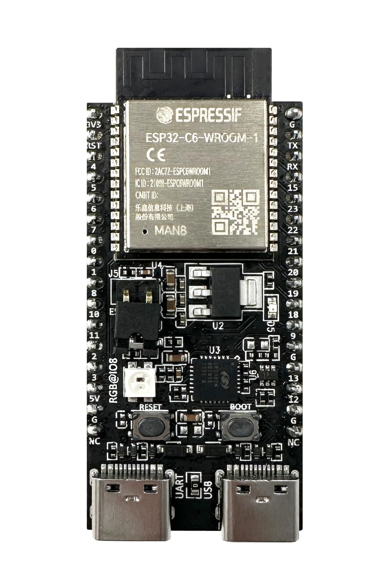
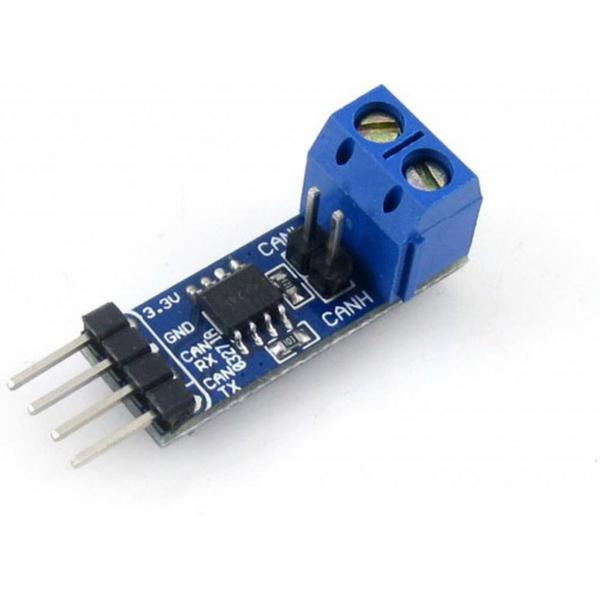
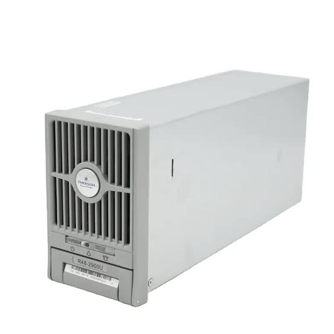

# esphome-emerson-r48

ESPHome configuration for controlling multiple Emerson/Vertiv R48 series rectifiers (R48-2900U, R48-2000 and similar) over CAN bus.

**[Русская версия](README.ru.md)**

## Features

- Individual voltage and current control for each rectifier
- Real-time monitoring (output voltage/current, input voltage, temperature, power, load %)
- Fault and status flags (overtemperature, fan failure, AC limitation, general fault)
- Fan mode control
- Phase load balancing based on input voltage
- Virtual total power limit
- Master voltage control (set the same voltage on all modules)
- Automatic module discovery (prints Heartbeat / Response / Command IDs)
- Automatic CAN bus recovery on communication loss
- Support for 1–3 modules

## Hardware

- Any ESP32 (ESP32, ESP32-C3, ESP32-C6, ESP32-S3, etc.)
- SN65HVD230 (or compatible) CAN transceiver
- 1–3 Emerson/Vertiv R48 rectifiers (e.g. R48-2900U)

<p align="center">
  
  
  
</p>

<p align="center">
  <em>ESP32-C6 · SN65HVD230 · Emerson R48-2900U</em>
</p>

### Wiring

| ESP32     | SN65HVD230 | Emerson R48      |
|-----------|------------|------------------|
| TX pin    | TXD        | —                |
| RX pin    | RXD        | —                |
| 3.3V      | VCC        | —                |
| GND       | GND        | —                |
| —         | CANH       | Pin 9 (CANH)     |
| —         | CANL       | Pin 6 (CANL)     |

Recommended topology (linear bus with termination):

```
ESP + 120Ω ────── PSU1 ────── PSU2 ────── PSU3 + 120Ω
```

Avoid star topology. Measure resistance between CANH and CANL (power off):
- ~60 Ω → two terminators (good)
- ~120 Ω → one terminator
- high resistance → no terminators

## Quick Start

1. Use the example from `examples/emersonscontrol.yaml` or connect packages remotely from this repository.
2. Set your CAN pins in substitutions (`can_tx_pin`, `can_rx_pin`) as **numbers only** (not `GPIO6`).
3. Prefer non-strapping pins (on ESP32-C6 avoid GPIO4/GPIO5 when possible).
4. Flash the device once and open the logs.
5. Press the **Show Detected Modules** button.
6. Copy the printed Heartbeat / Response / Command IDs into substitutions.
7. Re-flash.

Example substitutions:

```yaml
substitutions:
  # Numeric GPIO only (required for CAN Hard Reset / TWAI reinstall)
  can_tx_pin: "6"
  can_rx_pin: "10"

  psu1_command_id: "0x06080783"
  psu1_response_id: "0x060F8007"

  psu2_command_id: "0x06080F83"
  psu2_response_id: "0x060F800F"

  psu3_command_id: "0x06081783"
  psu3_response_id: "0x060F8017"
```

## Balancing

Balancing parameters (set in your device YAML):

| Parameter              | Description                              | Example |
|------------------------|------------------------------------------|---------|
| `balance_deadband`     | Ignore small input voltage differences   | `"2.0"` |
| `balance_gain`         | Amperes added per 1 V of difference      | `"1.5"` |
| `balance_min_current`  | Minimum current limit per module         | `"2.0"` |
| `balance_max_current`  | Maximum current limit per module         | `"55.0"`|
| `balance_interval`     | How often balancing runs                 | `"3s"`  |

Enable or disable balancing with the **Balancing Enable** switch.

You can also set:
- **Total Power Limit** — virtual power ceiling for all modules combined
- **All PSUs Set Voltage** — sets the same voltage on every module

## Packages

| File                    | Purpose                                      |
|-------------------------|----------------------------------------------|
| `packages/can_bus.yaml` | CAN interface + module discovery + status parsing |
| `packages/psu.yaml`     | Reusable template for one rectifier          |
| `packages/common.yaml`  | Polling, Hard Reset, Show Detected Modules   |
| `packages/balancing.yaml` | Phase balancing + master controls          |

## Credits

This project was made possible thanks to the work of many people in the community:

- Authors and contributors of various Emerson/Vertiv R48 CAN protocol reverse-engineering efforts (Endless Sphere and other DIY power electronics communities)
- [syssi/esphome-jk-bms](https://github.com/syssi/esphome-jk-bms) — excellent example of clean multi-device ESPHome package design
- ESPHome project and its contributors

## Disclaimer

This is an unofficial community project. Use at your own risk. The authors are not affiliated with Emerson, Vertiv or ESPHome.
